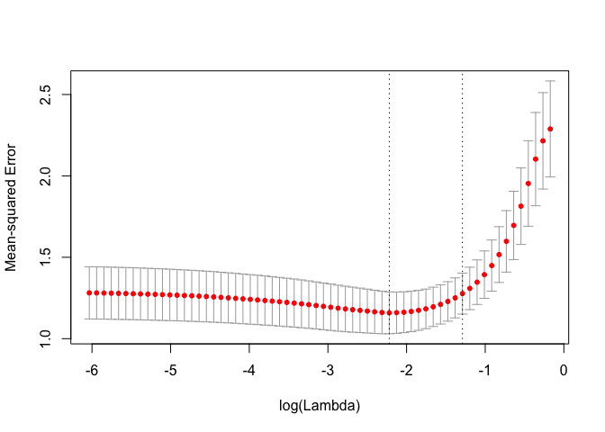

<!-- README.md is generated from README.Rmd. Please edit that file -->

# cvwrapr

<!-- badges: start -->

[](https://CRAN.R-project.org/package=cvwrapr)
<!-- badges: end -->

The goal of `cvwrapr` is to make cross-validation (CV) easy. The main
function in the package is `kfoldcv`. It performs K-fold CV for a
hyperparameter, returning the CV error for a path of hyperparameter
values along with other useful information. The `computeError` function
allows the user to compute the CV error for a range of loss functions
from a matrix of out-of-fold predictions. See the package vignettes for
more examples.

## Installation

You can install `cvwrapr` in the following ways:

``` r
# from CRAN
install.packages("cvwrapr")

# development version from GitHub
# install.packages("devtools")
devtools::install_github("kjytay/cvwrapr")
```

## Example

This is a basic example showing how to perform cross-validation for the
`lambda` parameter in the lasso (Tibshirani 1996).

``` r
# simulate data
set.seed(1)
nobs <- 100; nvars <- 10
x <- matrix(rnorm(nobs * nvars), nrow = nobs)
y <- rowSums(x[, 1:2]) + rnorm(nobs)

library(cvwrapr)
library(glmnet)

set.seed(1)
cv_fit <- kfoldcv(x, y, train_fun = glmnet, predict_fun = predict)
```

The returned output contains information on the CV procedure and can be
plotted.

``` r
names(cv_fit)
#>  [1] "lambda"     "cvm"        "cvsd"       "cvup"       "cvlo"      
#>  [6] "lambda.min" "lambda.1se" "index"      "name"       "overallfit"
plot(cv_fit)
```


